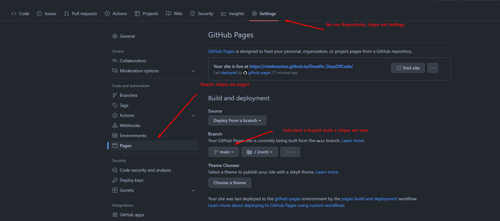

# Desafio #DaysOfCode
Projeto do desafio #7DaysOfCode do Github e Alura

Pagina inicial do projeto Filmes

## Publicando site no GitHub Pages

O GitHub Pages é um serviço de hospedagem de site estático que usa arquivos HTML, CSS e JavaScript diretamente de um repositório no GitHub e, como opção, executa os arquivos por meio de um processo e publica um site. 

É possível hospedar seu site no domínio github.io do GitHub ou no seu próprio domínio personalizado.

Para usar o github Pages, depois de criar o repositorio e adicionar os aquivos html/css ou javascript do seu site, segui o passo a passo na imagem a abaixo:

Depois que publicá-lo o github pages, pasta para visualizar o seu projeto você irá até a página:

https://SEU_USUARIO.github.io/NOME_DO_SEU_REPOSITORIO

